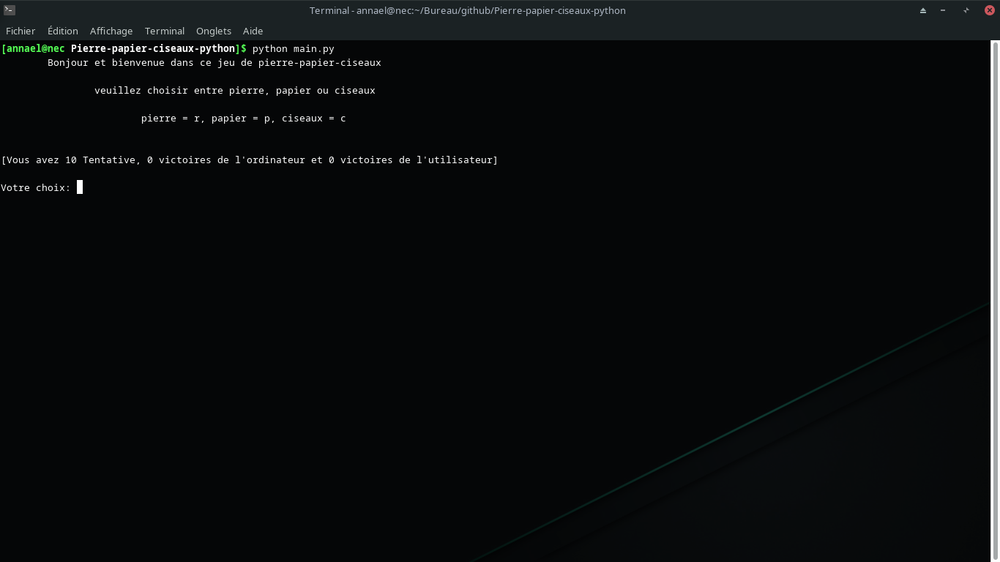

# Pierre-papier-ciseaux-python

Bonjour et bienvenue dans ce jeu de pierre-papier-ciseaux

## Authors

- [@Anna-el](https://github.com/Arcan7)


## Tech

- Python


## Run Locally

Clone the project

```bash
  git clone https://github.com/Arcan7/Pierre-papier-ciseaux-python.git
```

Go to the project directory

```bash
  cd Pierre-papier-ciseaux-python
```

Run dependencies

```bash
  python main.py
```
Run 

```bash
  ./main
```

Run with cmd

```bash
  run.bat
```


## Screenshots



